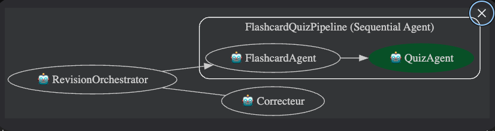
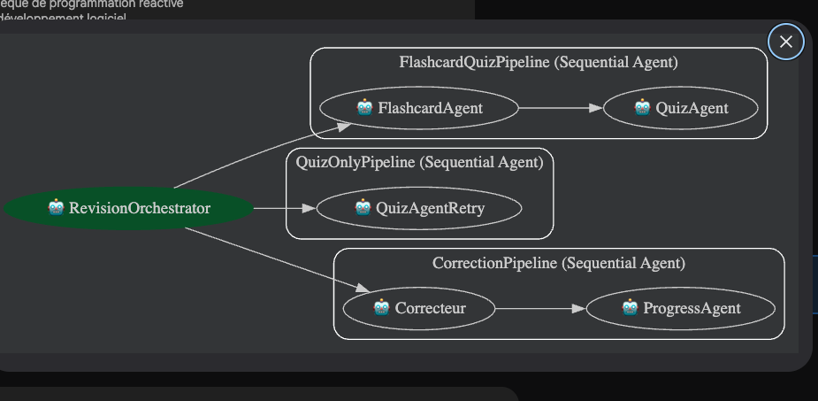

# Système de Révision Multi-Agents
**TP Agent Conversationnel — Google ADK | Mars 2026**

---

## 1. Présentation

Ce projet implémente un système de révision pédagogique multi-agents avec Google ADK. L'utilisateur envoie un sujet, reçoit une fiche de révision et un quiz, soumet ses réponses pour obtenir un corrigé détaillé et un suivi de progression.

---

## 2. Architecture

RevisionOrchestrator (root)
->FlashcardQuizPipeline (SequentialAgent)
(FlashcardAgent ->  génère la fiche de révision -> QuizAgent ->  génère le QCM (réponses extraites avant affichage))

->  QuizOnlyPipeline (SequentialAgent) (QuizAgentRetry ->  nouveau quiz sur la même fiche) 
-> CorrectionPipeline (SequentialAgent) (Correcteur ->  score calculé en Python pur (LLM jamais appelé) -> ProgressAgent ->  rapport de progression en Python pur (LLM jamais appelé))


 **Note sur le choix SequentialAgent :** À la demande du professeur, l'architecture devait inclure un `ParallelAgent`. Cependant, dans le pipeline de correction le `ProgressAgent` dépend directement du score calculé par le `Correcteur` — un `ParallelAgent` rendrait ce flux impossible car les deux agents s'exécuteraient simultanément sans partage d'état. Pour satisfaire la contrainte tout en maintenant un fonctionnement correct, d'autres pipeline séquentiel (`QuizOnlyPipeline, CorrectionPipelin`) ont été ajoutés, ce qui démontre la gestion de plusieurs workflows distincts avec deux `SequentialAgents` imbriqués dans un `SequentialAgent` racine.

Avant: 


Après:


## 3. Technologies

 Technologie | Version | Usage 
 Google ADK | latest | Framework : `LlmAgent`, `SequentialAgent`, callbacks, `AgentTool` 
 Groq API | `llama-3.1-8b-instant` | Modèle LLM principal (voir note ci-dessous) 
 Python | 3.13 | Langage de développement |
 LiteLLM | via ADK | Couche d'abstraction pour l'appel Groq 
 FastAPI / Uvicorn | via `adk web` | Interface web de test 
 `requests` | stdlib | Appel HTTP pour extraire les réponses avant génération du quiz 
 `re` | stdlib | Parsing des réponses utilisateur et du quiz 

 **Choix du modèle — `groq/llama-3.1-8b-instant` :** Le modèle local `llama3.2:3b` a été testé en premier. Il fonctionnait pour la génération de texte mais hallucinait systématiquement dans le `Correcteur` (inventait des scores, ignorait les bonnes réponses). Le passage à Groq API avec `llama-3.1-8b-instant` a résolu ce problème. Le modèle `gemini-2.0-flash` a aussi été tenté mais le quota gratuit était rapidement épuisé lors des tests.


## 5. Stratégie des callbacks

L'architecture repose sur des callbacks qui court-circuitent les LLMs pour les tâches logiques.

### `before_flashcard_callback`
Initialise le state à chaque nouvelle session : remet à zéro `correct_answers`, `score_actuel`, `wrong_questions` et toutes les variables de template pour éviter les `KeyError` ADK.

### `before_quiz_callback` — extraction avant affichage
Appel LLM séparé avec `temperature=0`, `max_tokens=30` qui demande uniquement `Q1=X Q2=X Q3=X Q4=X Q5=X`. Les bonnes réponses sont stockées dans le state **avant** que le `QuizAgent` génère le quiz — elles ne figurent jamais dans l'output visible.

### `after_quiz_callback` — filet de secours
Si `before_quiz_callback` échoue, tente 3 patterns regex successifs (`REPONSES_CACHEES`, `Q1=X`, `Réponse: X`) puis un second appel LLM dédié.

### `before_correcteur_callback` — bypass total du LLM
Le LLM du `Correcteur` n'est **jamais** appelé. Le callback parse les réponses utilisateur, compare avec `correct_answers`, construit le corrigé ligne par ligne et retourne directement un `LlmResponse`. Cela élimine les hallucinations sur les scores.

### `before_progress_callback` — bypass total du LLM
Même principe : le rapport de progression (barres visuelles `█░`, tendance, questions à retravailler) est entièrement généré en Python depuis `historique_scores`.

---

## 6. Flux d'une session

| Étape | Message | Agent actif | Action |
|---|---|---|---|
| 1 | `"Flutter"` | `root_router` → `FlashcardQuizPipeline` | `FlashcardAgent` génère la fiche |
| 2 | *(suite)* | `QuizAgent` | `before_quiz_callback` extrait les réponses, `QuizAgent` génère le quiz propre |
| 3 | `"CORRECTION: Q1=A..."` | `root_router` → `CorrectionPipeline` | `before_correcteur_callback` calcule le score en Python |
| 4 | *(suite)* | `ProgressAgent` | `before_progress_callback` génère le rapport, propose A) ou B) |
| 5a | `"A)"` | `root_router` → `FlashcardQuizPipeline` | Nouveau sujet → nouvelle fiche + quiz |
| 5b | `"B)"` | `root_router` → `QuizOnlyPipeline` | `QuizAgentRetry` génère un quiz différent sur la même fiche |

---

## 7. Structure du projet

```
tp-adk/
├── my_agent/
│   ├── __init__.py
│   ├── agent.py          # 6 agents, 3 pipelines, 6 callbacks
│   ├── .env              # GROQ_API_KEY=...
│   └── tools/
│       ├── __init__.py
│       └── my_tools.py   # calculer_score, enregistrer_reponses,
│                         # sauvegarder_reponses_correctes
├── main.py               # Runner + InMemorySessionService
├── README.md
└── .gitignore
```

---

## 8. Installation et lancement

### Prérequis
- Python 3.11+
- Clé API Groq gratuite : https://console.groq.com

### Installation
```bash
cd tp-adk
python -m venv .venv && source .venv/bin/activate
pip install google-adk
echo 'GROQ_API_KEY=votre_clé' > my_agent/.env
```

### Interface web
```bash
adk web
```
Puis ouvrir http://127.0.0.1:8000

### Runner programmatique
```bash
python main.py
```
Exécute le scénario de démonstration : `Flutter` → correction → `Python` → correction.

---

## 9. Exemple d'utilisation

| Message utilisateur | Réponse |
|---|---|
| `flutter` | Fiche de révision Flutter + QCM 5 questions |
| `CORRECTION: Q1=C, Q2=A, Q3=B, Q4=D, Q5=C` | Corrigé détaillé question par question + score /5 |
| `B)` | Nouveau quiz sur Flutter (questions différentes) |
| `python` | Nouvelle fiche Python + QCM |
